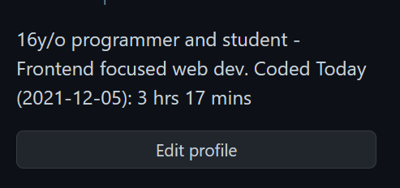

# Update GitHub bio

Automatically updates your GitHub bio with your WakaTime stats every 15 minutes

## Installation

### Usage

1. Clone the repo: `git clone https://github.com/Dev-CasperTheGhost/update-github-bio`
2. Install the dependencies: `npm install`
3. Copy and rename `.env.example` to `.env`
4. Update your credentials in `.env`
   - GitHub token: <https://github.com/settings/tokens> make sure to select the `user` scope
   - WakaTime api key: <https://wakatime.com/settings/api-key>
5. Build it! `npm run build`
6. Start it! `npm run start`
7. It should be running if nothing was returned!

### Running for 24/7

You can use [`pm2`](https://www.npmjs.com/package/pm2) to start this process in the background

1. Make sure that you have followed the steps above
2. Install pm2 globally: `npm install -g pm2`
3. Start it! `pm2 start npm --name github-bio -- run start`

## License

[MIT](./LICENSE)
